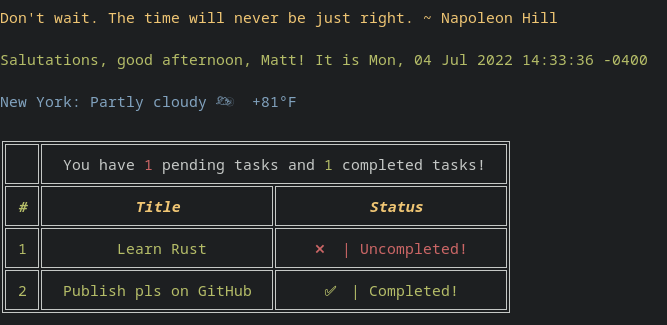
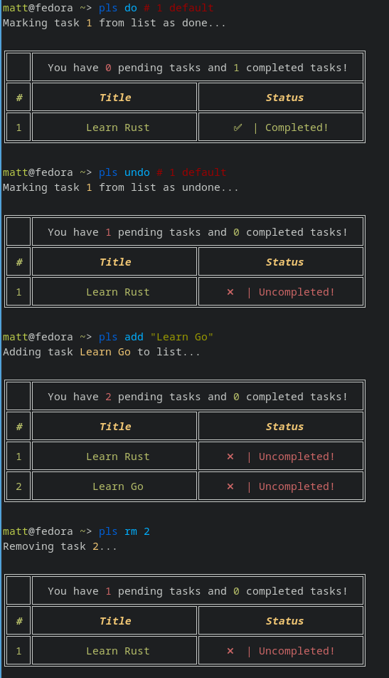

# Pls

Pls (short for please) is a console-based to-do list, that greets you with the weather, an inspirational quote, and any tasks you must complete. It is inspired by [please](https://github.com/NayamAmarshe/please), which is written in Python.


# Installation 

You can install `pls` by running: 
```bash
cargo install --git https://github.com/sigaloid/pls
```

# Usage 

```
# Show time, quotes and tasks
pls

# Add a task
pls add "TASK NAME"

# Delete a task
pls delete <TASK NUMBER>
pls del <TASK NUMBER>
pls remove <TASK NUMBER>
pls rm <TASK NUMBER>

# Mark task as done
pls done <TASK NUMBER>
pls do <TASK NUMBER>

# Mark task as undone
pls undone <TASK NUMBER>
pls undo <TASK NUMBER>

# Show tasks even if all tasks are markded as done
pls list
pls ls
```
[](https://asciinema.org/a/tq38FG5yP6AIZGymjc4LCe2jF)
