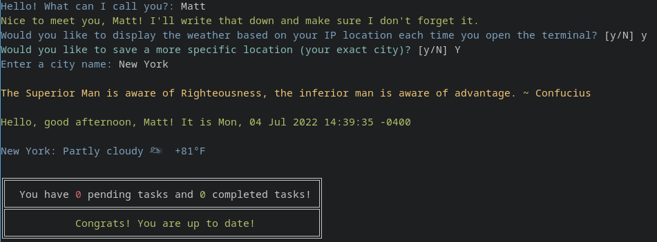

# Pls

Pls (short for please) is a console-based to-do list, that greets you with the weather, an inspirational quote, and any tasks you must complete. It is inspired by [please](https://github.com/NayamAmarshe/please), which is written in Python.


# Installation 

You can install `pls` by running: 
```bash
cargo install --git https://github.com/sigaloid/pls
```

# Usage 

```
# Show time, quotes and tasks
pls

# Add a task
pls add "TASK NAME"

# Delete a task
pls delete <TASK NUMBER>
pls del <TASK NUMBER>
pls remove <TASK NUMBER>
pls rm <TASK NUMBER>

# Mark task as done
pls done <TASK NUMBER>
pls do <TASK NUMBER>

# Mark task as undone
pls undone <TASK NUMBER>
pls undo <TASK NUMBER>

# Show tasks even if all tasks are markded as done
pls list
pls ls
```
[](https://asciinema.org/a/tq38FG5yP6AIZGymjc4LCe2jF)


# Weather information
Upon first launch you will be asked your name (for a greeting). Then you will be asked if you want to query for the weather data for your location.
The weather is retrieved from [wttr.in](https://github.com/chubin/wttr.in) and by default it will geolocate your location automatically.
To see what that looks like, click here: https://wttr.in/?format=%l:+%C+%c+%t
Alternatively, if the geolocation is not accurate, you can manually specify a city. For example, if you live in New York, visit https://wttr.in/new-york and verify that the coordinates are correct (some smaller cities may not exist in wttr.in's database). If the coordinates are correct, answer yes to "Would you like to save a more specific location (your exact city)?".

---
The weather is cached for one hour by default. After the cached weather data is expired, if you launch pls, by default it will *not* block the process to load the weather (unless -r is specified). It launches a background process to load the weather data and save it for the next time it is launched. This is to avoid ever having a bottleneck with the terminal never loading a shell because the internet is down, for example. This means if you launch the terminal rarely, the weather data may be out of date. If you want to force it to block on loading the weather data, launch pls with the -r/--refresh flag set.

# Benchmark

`pls` is significantly faster than `please` (one might even say blazingly fast). 

Benchmark 1: pls
  Time (mean ± σ):       3.1 ms ±   1.2 ms    [User: 1.3 ms, System: 1.8 ms]
  Range (min … max):     0.4 ms …  10.1 ms    5000 runs

  Warning: Command took less than 5 ms to complete. Results might be inaccurate.
  Warning: Statistical outliers were detected. Consider re-running this benchmark on a quiet PC without any interferences from other programs. It might help to use the '--warmup' or '--prepare' options.

Benchmark 2: please
  Time (mean ± σ):     134.5 ms ±   9.9 ms    [User: 121.1 ms, System: 12.7 ms]
  Range (min … max):   128.7 ms … 187.5 ms    5000 runs

Summary
  'pls' ran
   43.51 ± 17.30 times faster than 'please'

In summary, pls takes roughly 3ms to launch, and please takes roughly 134ms (unfortunately a noticeable delay).